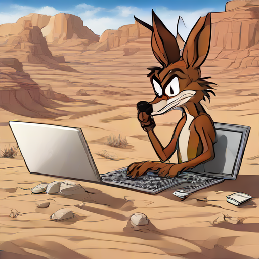

# coyote_interactive

## Introduction

## Installation

## Usage

### Main Application (coyote.py)
- Initializes the interactive environment using configuration from config.py.
- Integrates media commentary, button events, and audio transcription.

### Button Manager (buttons/button_manager.py)
- Handles customizable button press/release callbacks.
- Monitors button state to trigger interactive actions.

### Audio Transcription (audio_to_text/transcribe_continuously.py)
- Continuously transcribes audio using the whisper-stream tool.
- Logs transcriptions in real time with graceful interruption handling.

## Contributing

## License
